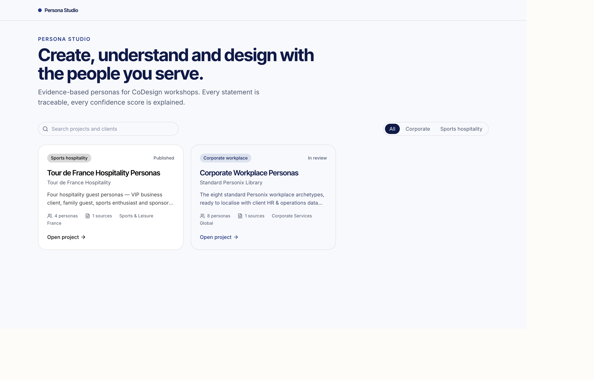
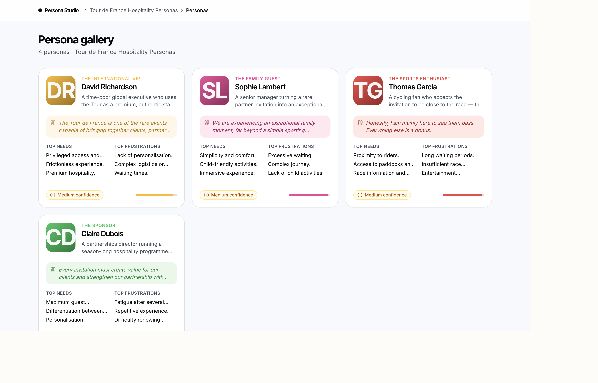
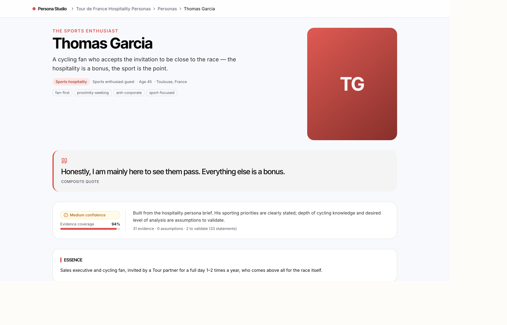

# Standard-Offer

A Next.js 15 application that hosts two things:

- The **Sodexo Spark / Standard Offer** selling deck and demos (under
  `/[locale]`, `/thales`, `/demos/*`).
- **Persona Studio** — a premium research + design tool for CoDesign teams,
  under `/studio`.

---

## Persona Studio

> Create, understand and design with the people you serve.

Persona Studio lets Sodexo CoDesign teams create, visualize, talk to, and
workshop **evidence-based personas** for client workshops. Every statement is
traceable (`EVIDENCE / ASSUMPTION / TO_VALIDATE`), every confidence score is
explained, and the AI is always a research-grounded simulation — never a real
person.

It ships with two seeded projects:

1. **Corporate Workplace Personas** — the 8 Personix archetypes.
2. **Tour de France Hospitality Personas** — David Richardson, Sophie Lambert,
   Thomas Garcia, Claire Dubois.

### Screenshots

| Library | Gallery (Tour de France) | Persona detail |
|---|---|---|
|  |  |  |

### Status

Phase 1 (Foundation) is implemented on seed data with mock auth. See
[`docs/persona-studio/ROADMAP.md`](docs/persona-studio/ROADMAP.md).

### Docs

- [Product](docs/persona-studio/PRODUCT.md)
- [Architecture](docs/persona-studio/ARCHITECTURE.md)
- [Data model](docs/persona-studio/DATA_MODEL.md)
- [AI grounding](docs/persona-studio/AI_GROUNDING.md)
- [Security](docs/persona-studio/SECURITY.md)
- [Roadmap](docs/persona-studio/ROADMAP.md)

---

## Local setup

```bash
npm install
npm run dev
# then open http://localhost:3000/studio
```

### Environment variables

Phase 1 requires **none** (Persona Studio runs on seed data with mock auth).
Later phases read these **server-side only** (validated in
`src/lib/persona-studio/validation/env.ts`):

| Variable | Phase | Notes |
|---|---|---|
| `OPENAI_API_KEY` | 3 | Server-only; never exposed to the browser |
| `NEXT_PUBLIC_SUPABASE_URL` | 5 | Public |
| `NEXT_PUBLIC_SUPABASE_ANON_KEY` | 5 | Public |
| `SUPABASE_SERVICE_ROLE_KEY` | 5 | Server-only |

> ⚠️ Never give an autonomous coding agent production database credentials,
> unscoped infrastructure tokens, or production deletion access. See
> [`docs/persona-studio/SECURITY.md`](docs/persona-studio/SECURITY.md).

### Supabase / OpenAI / migrations / seed

Not required for Phase 1. Persona Studio's seed data is the TypeScript dataset
in `src/lib/persona-studio/data/seed/`. Supabase (Postgres + Auth + Storage +
RLS, pgvector) and the OpenAI Responses API are wired in later phases behind the
`PersonaRepository` and AI-provider interfaces.

## Commands

```bash
npm run dev          # dev server
npm run build        # production build
npm run start        # serve production build
npm run lint         # eslint
npx tsc --noEmit     # typecheck
npm run test         # vitest (unit)
npm run test:watch   # vitest watch
```

## Deployment

Deployed on Vercel (see `vercel.json`). Persona Studio needs no extra
configuration in Phase 1.
